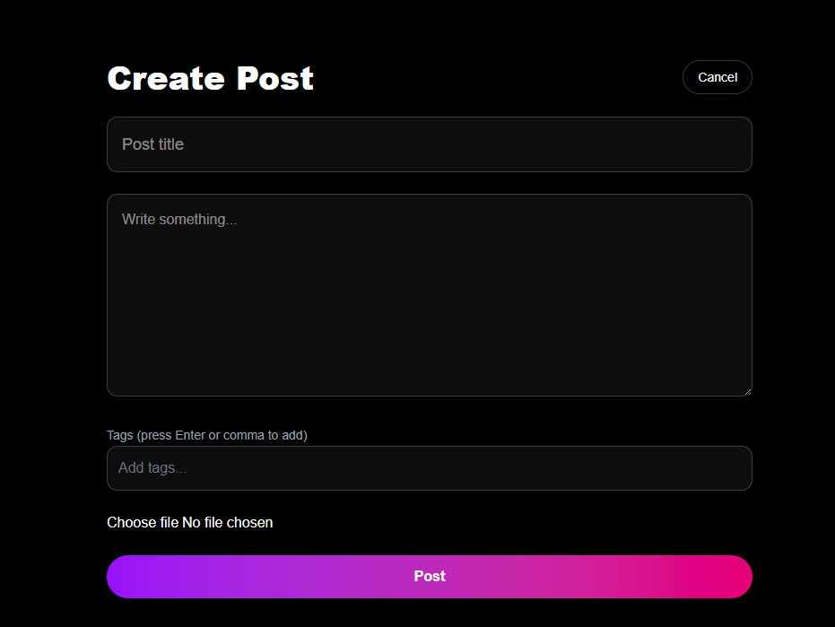
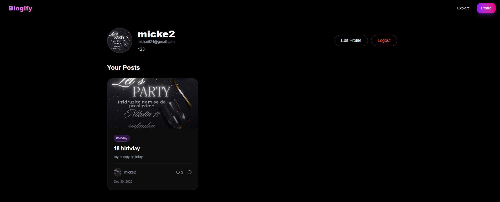
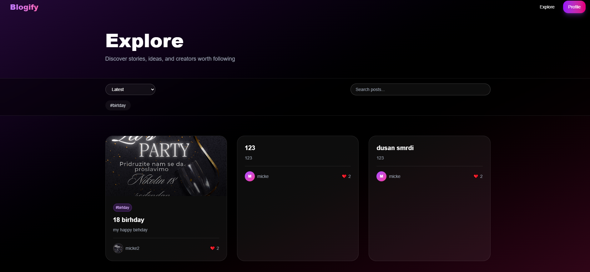

# Blog Platform

A modern, full-stack blog platform built with Next.js, TypeScript, and MongoDB. Features user authentication, post creation and editing, commenting, liking, and image uploads via Cloudinary.

**Live Demo**: [https://blog-platform-mu-navy.vercel.app/]

## Features

- **User Authentication**: Secure login and registration with JWT tokens
- **Post Management**: Create, edit, and delete blog posts with rich text editor
- **Comments & Likes**: Interactive commenting system and post liking functionality
- **User Profiles**: Personalized profiles with editable information
- **Image Uploads**: Cloudinary integration for post images and profile pictures
- **Responsive Design**: Mobile-first design with Tailwind CSS
- **Real-time Updates**: Dynamic UI updates with React
- **Search & Explore**: Search posts and explore trending content

## Screenshots

- **Home Page**
  

- **Post Editor**
  

- **User Profile**
  

- **Explore Page**
  

## Tech Stack

- **Frontend**: Next.js 16, React 19, TypeScript
- **Styling**: Tailwind CSS v4, Radix UI, Lucide React icons
- **Backend**: Next.js API Routes
- **Database**: MongoDB with Mongoose ODM
- **Authentication**: JWT (JSON Web Tokens) with bcryptjs
- **File Storage**: Cloudinary
- **Animations**: Framer Motion
- **Linting**: ESLint

## Prerequisites

- Node.js 18+ and npm/yarn/pnpm
- MongoDB database (local or cloud like MongoDB Atlas)
- Cloudinary account for image uploads

## Installation

1. **Clone the repository:**
   ```bash
   git clone https://github.com/Micke491/Blog-Platform.git
   cd blog-platform
   ```

2. **Install dependencies:**
   ```bash
   npm install
   # or
   yarn install
   # or
   pnpm install
   ```

3. **Run the development server:**
   ```bash
   npm run dev
   # or
   yarn dev
   # or
   pnpm dev
   ```

   Open [http://localhost:3000](http://localhost:3000) in your browser.

## API Endpoints

The API is built with Next.js API Routes. Key endpoints include:

- `POST /api/auth/register` - User registration
- `POST /api/auth/login` - User login
- `GET /api/posts` - Fetch posts
- `POST /api/posts` - Create a new post
- `GET /api/posts/[id]` - Get a specific post
- `PUT /api/posts/[id]` - Update a post
- `DELETE /api/posts/[id]` - Delete a post
- `POST /api/posts/[id]/comment` - Add a comment
- `POST /api/posts/[id]/like` - Like/unlike a post
- `GET /api/me` - Get current user info
- `PUT /api/edit_profile` - Update user profile
- `POST /api/upload` - Upload images

## Project Structure

```
blog-platform/
├── app/                    # Next.js App Router pages and API routes
│   ├── api/               # API endpoints
│   ├── explore/           # Explore page
│   ├── login/             # Login page
│   ├── post/              # Post detail pages
│   ├── profile/           # User profile pages
│   └── register/          # Registration page
├── components/            # Reusable React components
├── lib/                   # Utility functions and configurations
├── models/                # Mongoose models
├── public/                # Static assets
└── ...config files
```

## Contributing

1. Fork the repository
2. Create a feature branch (`git checkout -b feature/amazing-feature`)
3. Commit your changes (`git commit -m 'Add some amazing feature'`)
4. Push to the branch (`git push origin feature/amazing-feature`)
5. Open a Pull Request

## License

This project is licensed under the MIT License - see the [LICENSE](LICENSE) file for details.

## Support

If you have any questions or issues, please open an issue on GitHub.